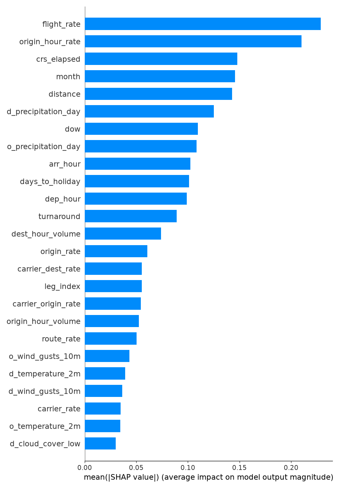

# Will My Flight Be Delayed?

**Live site:** https://kennedyjohnson.github.io/will-my-flight-be-delayed/

Enter a US domestic flight number and date to get the chance it arrives 15+ minutes late (or is cancelled/diverted), with a route map, flight details, live weather and a breakdown of what's driving the estimate.

## Model

- **Data:** 7.0M flights from the BTS Reporting Carrier On-Time Performance data (Aug 2025 – Jul 2026), hourly historical weather at each airport from Open-Meteo, and aircraft type/age from the FAA aircraft registry.
- **Features:** historical delay rates (target-encoded out-of-fold) for the airline, airports, route, flight number, aircraft type and inbound airport; departure/arrival hour, day of week, month, days to a major holiday; airport congestion; the plane's typical leg of the day and scheduled turnaround; regional vs mainline operator; and weather at both ends.
- **Algorithm:** LightGBM, with weather randomly withheld from 15% of training rows so it also works beyond the 16-day forecast window.
- **Feature selection:** SHAP (TreeExplainer) ranks features; ones below 2% of the top feature's mean |SHAP| are dropped if that doesn't hurt validation log loss.
- **Evaluation** (trained through May 2026, tested on Jun–Jul 2026):

| Predictor | AUC | Brier |
|---|---|---|
| National average | 0.500 | 0.209 |
| Airline's historical rate | 0.556 | 0.208 |
| Flight number's historical rate | 0.618 | 0.203 |
| Model, no weather | 0.691 | 0.194 |
| **Model, with weather** | **0.731** | **0.182** |

The deployed model is refit on all 24 months. It runs entirely in the browser: trees are exported to JSON and evaluated in `docs/js/model.js`, with per-prediction feature attributions from the tree paths.



### Live scorecard

A validation split only says how the model *should* do. So when BTS releases a new month, and before the retrain replaces anything, [`pipeline/scorecard.py`](pipeline/scorecard.py) scores the model the site was actually serving on that month's flights. The model never saw them. It uses the published tree dump, lookup tables and schedules, through a Python port of `model.js` that matches it exactly. Results go to [`docs/data/scorecard.json`](docs/data/scorecard.json) and appear on the site under "How it works":
- AUC and Brier score.
- AUC of the flight-history baseline.
- Predicted vs actual delay rate, plus a calibration table.
- Coverage, meaning the share of flights the site could have looked up.

If live AUC falls more than 0.03 below validation AUC, the workflow opens an issue. One caveat: the scorecard uses archived weather, while users get forecasts, so its weather inputs are a best case.

## Reproduce

```bash
pip install -r requirements.txt
python pipeline/00_download.py   # rolling 24 months of BTS + airports + FAA registry
python pipeline/01_load.py
python pipeline/02_weather.py
cd pipeline && python scorecard.py && python train.py && python check_metrics.py && python export.py
```

## Limitations

Flight schedules come from flights operated in the 8 weeks before the latest BTS release, so new or changed flights may be missing. It can't see day-of issues like ATC ground stops, crew or mechanical problems.

## Tools used

- Python
- LightGBM
- SHAP
- Leaflet
- JavaScript
